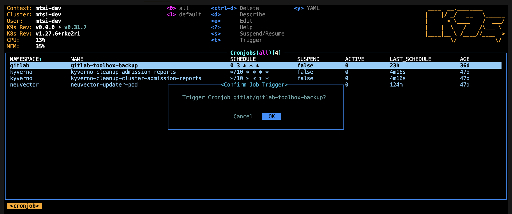

# Backup and Restore

## Velero
This bundle has Velero configured to run automated backups and stores that data to the configured object storage bucket. The backup can be kicked off manually. Below is a start to finish process of taking a backup and restoring it, including restoring data on the Persistant Volume. If running a restore off of an automated backup, skip the first, manual step; the rest is the same.

- Manually kick off a backup
```bash
$ kubectl exec -it -n velero svc/velero -- /bin/bash -c "velero backup create \
  manual-nexus-velero-backup-$(date +%s) --include-namespaces nexus"

Backup request "manual-nexus-velero-backup-1716311265" submitted successfully.
Run `velero backup describe manual-nexus-velero-backup-1716311265` or `velero backup logs manual-nexus-velero-backup-1716311265` for more details.
```

- Delete the PVC (Velero will not restore data if the backed up PV/PVC still exist)
```bash
$ kubectl delete pvc nexus-nexus-repository-manager-data

persistentvolumeclaim "nexus-nexus-repository-manager-data" deleted
```

- Remove the finalizers on the PVC, allowing it to be deleted
  ```yaml
    finalizers:
      - kubernetes.io/pvc-protection
  ```
```bash
$ kubectl edit pvc nexus-nexus-repository-manager-data

persistentvolumeclaim/nexus-nexus-repository-manager-data edited

$ kubectl get pvc

No resources found in nexus namespace.
```

- Run the restore
```bash
$ kubectl exec -it -n velero svc/velero -- /bin/bash -c "velero restore create velero-test-nexus-restore-$(date +%s) \
  --from-backup manual-nexus-velero-backup-1716311265 --include-namespaces nexus --wait"

Restore request "velero-test-nexus-restore-1716311387" submitted successfully.
Waiting for restore to complete. You may safely press ctrl-c to stop waiting - your restore will continue in the background.
.........
Restore completed with status: Completed. You may check for more information using the commands `velero restore describe velero-test-nexus-restore-1716311387` and `velero restore logs velero-test-nexus-restore-1716311387`.
```

At this point, the pods should restart with the new data. The pods can also be deleted and allowed to recreate. Data should be restored to the PV from the time of the backup.

> [!WARNING]
> Unfortunately [according to the nutanix docs](https://portal.nutanix.com/page/documents/solutions/details?targetId=NVD-2177-Cloud-Native-6-5-OpenShift:application-backup-and-disaster-recovery.html#:~:text=As%20an%20alternative%20solution), NFS shares that are dynamically provisioned by the Nutanix Files CSI provisioner don't currently support the Kubernetes CSI Snapshot API -- meaning RWX volumes WILL NOT BE BACKED UP BY THIS PROCESS until an alternative solution like restic is in place.

## Gitlab
Gitlab has its own utility to perform the backup and restore functionality. More details on how to use it shown are below.

You may also need to recover and apply the following secrets in the `gitlab` namespace if the currently deployed secrets don't match your recovered backup. Those can be found in the corresponding gitlab velero backup.
- `gitlab-gitlab-initial-root-password`
- `gitlab-rails-secret`

### Backup
Gitlab is configured to take automatic backups and store those backups to the configured object storage bucket.

- If desired, you can manually trigger a backup by triggering the Kubernetes CronJob that is used for the automated backups.
CLI:
```bash
kubectl create job -n gitlab \
  --from=cronjob/gitlab-toolbox-backup \
  gitlab-toolbox-backup
```

Trigger from K9s:


### Restore
- Retrieve the filename of the desired backup from the configured gitlab-backup object storage bucket. Everything up through the `ee`.
- Using the `backup-utiliity` in the gitlab-toolbox pod along with the filename of the backup you can initiate a restore. Example kubectl command below.
```bash
kubectl exec -it -n gitlab deploy/gitlab-toolbox -- /bin/bash -c \
        "backup-utility --restore -t 1702938944_2023_12_18_16.5.1-ee"
```
- Cycle the gitlab-runner pod once restore is complete.

# Databases
It is recommended to use the native database backup tools provided by your database provider to create your backups and create a new restored DB to switch to.

[Nutanix NDB](https://portal.nutanix.com/page/documents/solutions/details?targetId=BP-2061-PostgreSQL-on-Nutanix:BP-2061-PostgreSQL-on-Nutanix)

[AWS RDS](https://docs.aws.amazon.com/AmazonRDS/latest/UserGuide/CHAP_CommonTasks.BackupRestore.html)

Once you have the desired DB with the restored data live and ready you can update your `uds-config.yaml` to point to this new restored DB and run a `uds deploy <bundle>` to update the cluster.
