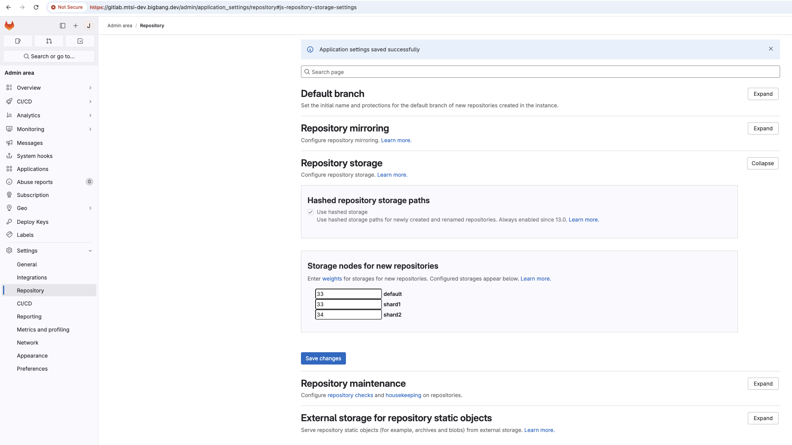
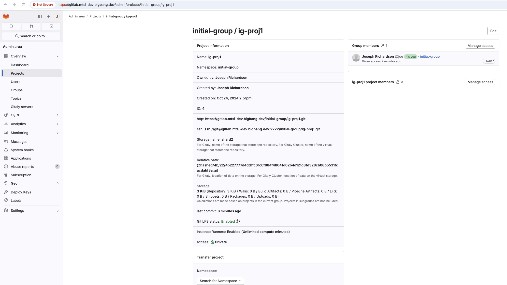
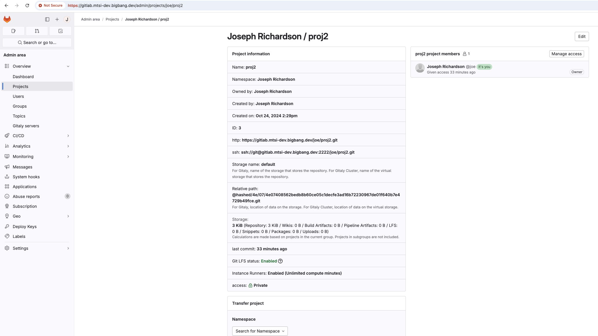

# Configuration Notes

Collected notes to aid in configuring GitLab for your environment.

## Sharded Gitaly

[Gitaly](https://docs.gitlab.com/ee/administration/gitaly/), the git server inside GitLab, has a few HA configurations. The Gitaly cluster (where multiple Gitaly nodes are clustered together, each one as the sole-tenant on a server/VM) is the recommended approach but is not supported on k8s (see [epic](https://gitlab.com/groups/gitlab-org/-/epics/6127) for more details). Sharded Gitaly does work on k8s though. With Gitaly sharded, the gitaly statefulset will increase it's number of replicas with each one becoming a different storage path for GitLab. Per the weights set by the administrator in the GitLab UI, GitLab will roll-the-dice to determine which gitaly receives each repo as it's created. It is on the administrators to rebalance nodes when random distributions lead to poor distribution of traffic. Read about [Gitaly capabilities](https://docs.gitlab.com/ee/administration/gitaly/gitaly_geo_capabilities.html#gitaly-capabilities) for more information on the trade-offs and risks between Gitaly Clusters and Gitaly Shards.

To increase the number of Gitaly shards edit the value of the GITALY_SHARD_NAMES variable in your uds-config file. [The first shard must always be named `default`](https://docs.gitlab.com/ee/administration/gitaly/configure_gitaly.html?tab=Helm+chart+%28Kubernetes%29#gitlab-requires-a-default-repository-storage). Beyond that, they can be named anything. If you are adding shards, be aware GitLab does not automatically re-balance repos across shards. You must do that manually. Similarly, if dropping a shard, you must move the repos onto other shards first. Helm has no built-in repo migrator. See [this GitLab cookbook for repo migration commands](https://dev.gitlab.org/cookbooks/runbooks/-/blob/gitaly-total-cpu/howto/sharding.md#moving-repositories-between-shards) and the [API documentation](https://docs.gitlab.com/ee/api/rest/).

Here is an example of the GitLab admin screen after rebalancing the shard weights from 100 for `default` (the initial setting) to equal balance across the shards.

You can confirm newly created repos are going to different shards by viewing them in the `Admin area` and checking the Storage name. The screenshots below show repos created in testing going to different shards (keep the expected value concept in mind - not all shards may be used via the random-weighted distribution until many repos have been created and inspected).

## Prevent Gitaly Shard OOM

The UDS Config variable `GITALY_CGROUPS` allows adminstrators to improve the resiliency of each gitaly node. The proper values are heavily context specific so it is disabled by default. However, the value given to that variable will be substituted directly into the `gitlab.gitaly.cgroups` path [documented here](https://docs.gitlab.com/ee/administration/gitaly/kubernetes.html#constrain-git-processes-resource-usage). Adding these values will reduce the risk a single git call will cause the gitaly node (shard) to be killed with an OOM error.
