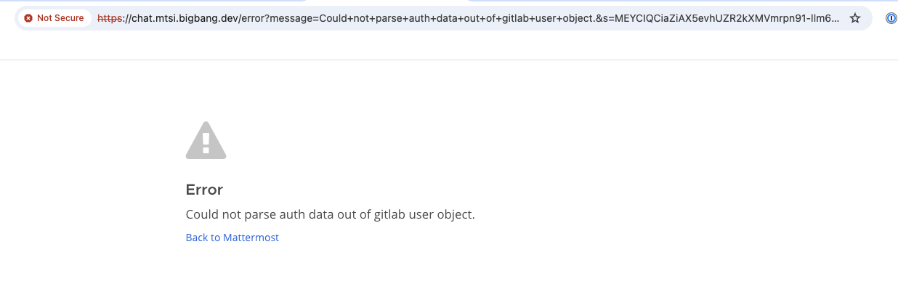
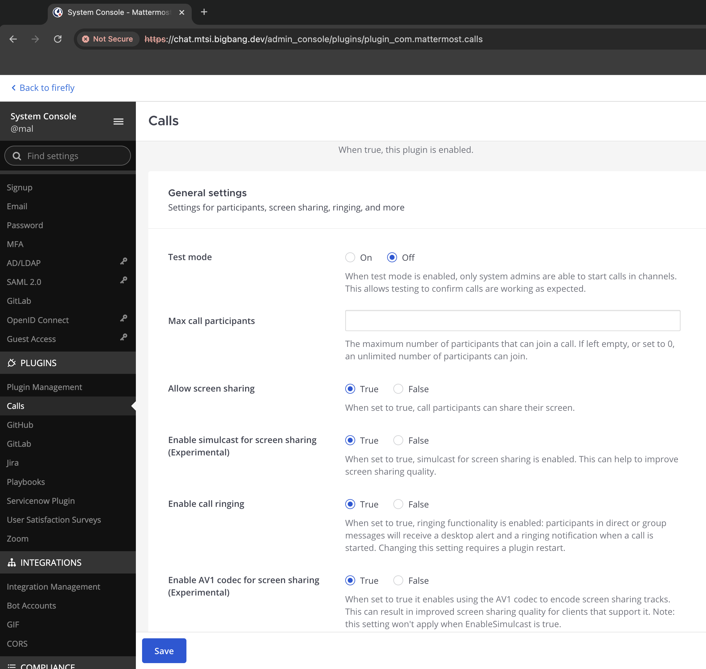

# Configuration Notes

## SSO

When creating users for Mattermost in Keycloak, be sure to put a `mattermostid` in for the user. If you don't, when you sign into Mattermost `via GitLab` you'll get the `Could not parse auth data out of gitlab user object` error.

If you create an invalid `mattermostid` (such as entering a person's name) you'll get an invalid OAuth object error. It expects a (unique) string of numbers.

If creating totally new users, it's best to have them use the sign-up process in Keycloak to ensure properly configured users. Importing users from
an external system en-masse into the UDS Keycloak is outside the scope of this document.

## Enabling Calls

The calls plugin starts out in [test mode](https://docs.mattermost.com/configure/plugins-configuration-settings.html#test-mode). Administrators must turn it on if it's desired.

This is presently a known issue (calls don't work). Review [#73](https://github.com/defenseunicorns/uds-bundle-software-factory-nutanix/issues/73) for updates.
