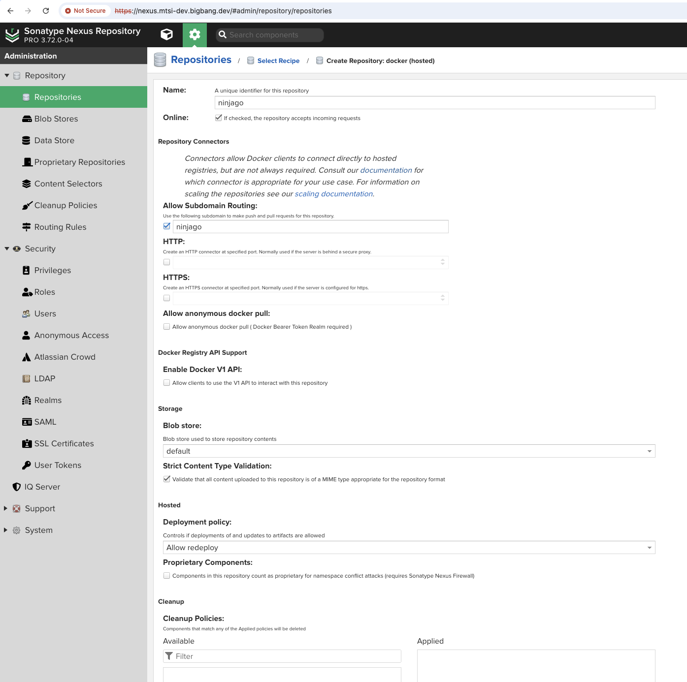
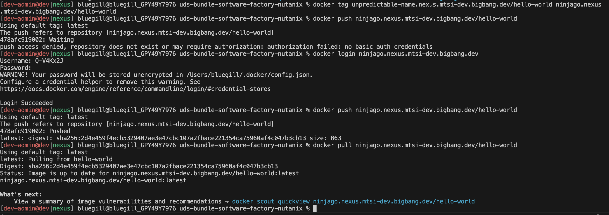

# Configuration notes

**Links**:
- The package repo: <https://github.com/defenseunicorns/uds-package-nexus>
- The upstream BigBang helm chart <https://repo1.dso.mil/big-bang/product/packages/nexus>

## Multiple Docker Registries via sub-domains

Nexus supports multiple docker registries in the same Nexus instance. In all editions of Nexus, this can be done by giving [each registry it's own port](https://help.sonatype.com/en/ssl-and-repository-connector-configuration.html). If using Nexus Pro, however, registries can each be [given their own sub-domain](https://help.sonatype.com/en/docker-authentication.html), while using the default port. This means docker clients can speak simply in terms of the URL without specifying a port. This bundle has been setup to support the latter configuration.

> **Note:** we make _no_ use of the mutliple registry related values provided in the upstream Big Bang helm chart. The chart is setup for mutliple registries by multiple ports. It's features do no good and actually do harm to multiple registries via sub-domains.

Once deployed, the Istio Tenant Gateway will route all HTTP(S) traffic which hits `*.nexus.{your-fqdn}` to Nexus main port (same port that receives UI traffic). For any subdomain where a registry exists, Nexus will internally route the traffic to the appropriate handler.

As an operator, you can setup & test multiple docker registries by following these steps. As your preferences differ from the example, see [the official Nexus documentation](https://help.sonatype.com/en/nexus-repository-administration.html) and linked throughout for help.

1. Deploy the bundle. Note the addition in release 0.5.0 of the UDS_CONFIG variable with path `variables.core.TENANT_HOST_LIST`. This new variable must have at least these values, see in-line comments for each value's function.

```yaml
variables:
  core:
    TENANT_HOST_LIST:
      - "*"  # Tells the tenant gateway to permit traffic at *.{your_fqdn}
      - "*.nexus"  # Tells the tenant gateway to additionally expect (and permit) traffic at *.nexus.{your_fqdn}
```

2. Log into the Nexus UI as an admin (logging into Keycloak and provisioning a user is out of scope for this tutorial) and make two changes to the security settings.
    1. Enable `User Tokens`. These are required for Docker clients to authenticate to the Nexus registry. Ordinary usernames and passwords won't work (same as with Artifactory or Harbor except Nexus has a token user too).
    2. Under [Realms](https://help.sonatype.com/en/realms.html), add the `Docker Bearer Token Realm` as explained [in the Nexus Docker Authentication docs](https://help.sonatype.com/en/docker-authentication.html) to enable Docker client interaction.
    3. Go to your user's account page, select the `User Token` tab on the left, and generate a token. Save the token user and password for later.

3. Create a (for the sake of illustration we'll do `hosted`) Docker registry at your choice of a sub-domain. Do not attempt multiple levels of sub-domain routing. The Tenant Gateway is not expecting `*.*.nexus.{your_fqdn}` traffic and [Nexus will only route based on the first sub-domain anyway](https://help.sonatype.com/en/docker-subdomain-connector.html). See example below where the registry name and sub-domain name are `ninjago` after [the kid's TV show](https://www.imdb.com/title/tt1871731/?ref_=fn_al_tt_2):

    

4. Test the registry by logging in via your token user and password (saved in step 1.3), and pushing/pulling an image. In the screenshot below, we retagged the docker `hello-world` image from the first sub-domain registry we created and tested (`unexpected-name`) to the second one (`ninjago`), signed-in to `ninjago`, and pushed/pulled the image to prove in development that mutliple registries were working. See [issue #186](https://github.com/defenseunicorns/uds-bundle-software-factory-nutanix/issues/186) for bundle developer notes and broader context on the screenshot.

    

**Links**:
- <https://help.sonatype.com/en/nexus-repository-administration.html>
- <https://help.sonatype.com/en/ssl-and-repository-connector-configuration.html>
- <https://help.sonatype.com/en/docker-authentication.html>
- <https://help.sonatype.com/en/realms.html>
- <https://help.sonatype.com/en/docker-subdomain-connector.html>
